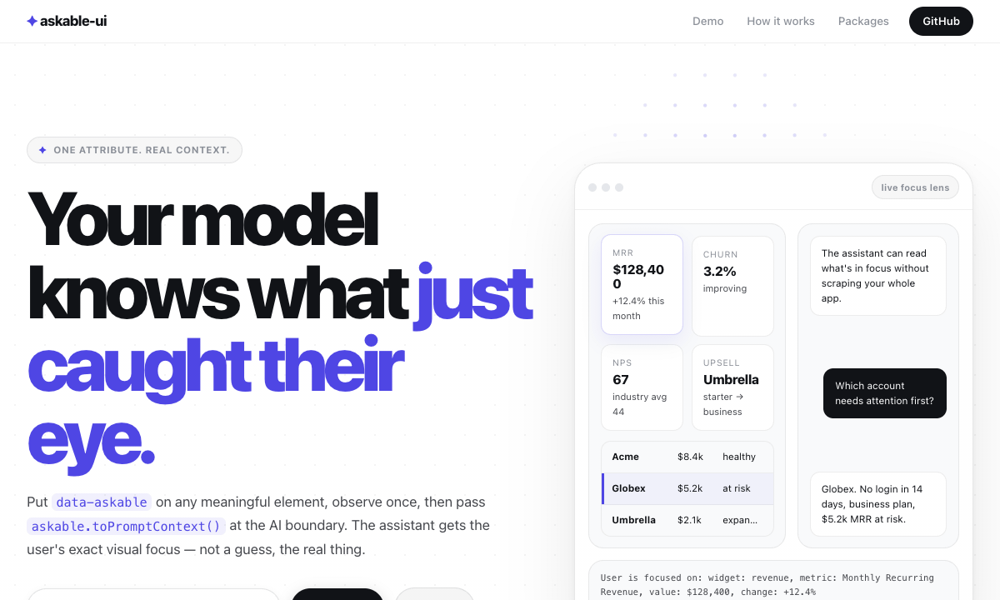

# askable-ui

[](https://www.npmjs.com/package/@askable-ui/core)
[](https://bundlephobia.com/package/@askable-ui/core)
[](./LICENSE)

**Give any UI element LLM awareness with one attribute.**



---

## The problem in one sentence

Your LLM doesn't know what the user is looking at — so when they click a chart and ask *"why is this dropping?"*, it guesses.

## The fix in one line

```html
<div data-askable='{"chart":"revenue","delta":"-12%","period":"Q3"}'>
  <RevenueChart />
</div>
```

That's it. The same data that renders your component becomes the AI's context. No duplication, no custom events, no framework lock-in.

---

## How it works

```
1. ANNOTATE  →  data-askable on any element that carries meaning
2. OBSERVE   →  askable.observe(document)  — one call, covers everything
3. INJECT    →  askable.toPromptContext()  — drop into any LLM call
```

```ts
// Before askable
LLM receives: "why is this dropping?"
LLM answers:  "Revenue can decline due to many factors such as..."

// After askable — same question, radically better answer
LLM receives: "UI context: metric: revenue, delta: -12%, period: Q3
               Question: why is this dropping?"
LLM answers:  "Your Q3 revenue fell 12%. Based on the data you're
               viewing, the most likely cause is..."
```

---

## Install

```bash
npm install @askable-ui/core      # zero deps, ~1kb gz
npm install @askable-ui/react     # React 17+
npm install @askable-ui/vue       # Vue 3
npm install @askable-ui/svelte    # Svelte 4

pip install askable-django        # Django 4+
pip install askable-streamlit     # Streamlit
```

---

## Quick start

```ts
import { createAskableContext } from '@askable-ui/core';

const askable = createAskableContext();
askable.observe(document);

// In your AI handler — one line
const prompt = askable.toPromptContext();
// → "User is focused on: chart: revenue, delta: -12%, period: Q3"
```

### React

```tsx
import { Askable, useAskable } from '@askable-ui/react';

function Dashboard() {
  const { data } = useSWR('/api/metrics');

  return (
    <Askable meta={data.revenue}>        {/* ← same data renders the chart */}
      <RevenueChart data={data.revenue} /> {/* ← AND feeds the AI */}
    </Askable>
  );
}

function AIInput() {
  const { promptContext } = useAskable({ events: ['click'] });

  return (
    <input
      placeholder="Ask about what you're looking at…"
      onKeyDown={e => {
        if (e.key === 'Enter') sendToLLM(promptContext, e.currentTarget.value);
      }}
    />
  );
}
```

### "Ask AI" button pattern

```tsx
function RevenueCard({ data }) {
  const { askable } = useAskable();
  const ref = useRef<HTMLDivElement>(null);

  return (
    <Askable meta={data} ref={ref}>
      <RevenueChart data={data} />
      <button onClick={() => { askable.select(ref.current!); openChat(); }}>
        ✦ Ask AI
      </button>
    </Askable>
  );
}
```

### Vue

```vue
<script setup>
import { Askable, useAskable } from '@askable-ui/vue';
const { promptContext } = useAskable({ events: ['click', 'focus'] });
</script>

<template>
  <Askable :meta="{ chart: 'revenue', period: 'Q3' }">
    <RevenueChart />
  </Askable>
  <AIChatInput :context="promptContext" />
</template>
```

### Django

```django



  <canvas id="revenue-chart"></canvas>

```

```python
# views.py
def ai_chat(request):
    data = json.loads(request.body)
    return JsonResponse({
        'answer': llm.chat(
            system=f"UI context: {data['context']}",
            user=data['question'],
        )
    })
```

---

## Works with every LLM

```ts
// Vercel AI SDK
system: `You are a helpful assistant.\n\n${askable.toPromptContext()}`

// OpenAI
{ role: 'system', content: `UI context:\n${askable.toPromptContext()}` }

// Anthropic
system: `UI context:\n${askable.toPromptContext()}`
```

---

## Why not just pass state manually?

You could. You'd also write your own router.

| | DIY wiring | askable |
|---|---|---|
| Setup per component | Custom event + serializer | `data-askable` |
| Dynamic elements | Manual re-wire | MutationObserver built-in |
| Framework lock-in | Re-implement per stack | One core, thin adapters |
| Bundle cost | Your code + your bugs | ~1kb gz, zero deps |
| Python support | Build it yourself | Django + Streamlit ready |

---

## Packages

| Package | Description | Size |
|---|---|---|
| [`@askable-ui/core`](./packages/core) | Framework-agnostic observer + context | ~1kb gz |
| [`@askable-ui/react`](./packages/react) | `<Askable>` + `useAskable()` | ~0.5kb gz |
| [`@askable-ui/vue`](./packages/vue) | `<Askable>` + `useAskable()` | ~0.5kb gz |
| [`@askable-ui/svelte`](./packages/svelte) | `<Askable>` + `createAskableStore()` | ~0.5kb gz |
| [`askable-django`](./packages/python/django) | Template tags + auto-inject middleware | — |
| [`askable-streamlit`](./packages/python/streamlit) | Returns focus as Python dict | — |

---

## API

### `createAskableContext()`
Returns a new context instance.

### `askable.observe(el, options?)`
Start watching `el`. Tracks click, hover, and focus on all `[data-askable]` elements — including ones added dynamically.

```ts
askable.observe(document)                          // all triggers
askable.observe(document, { events: ['click'] })   // click only
askable.observe(document, { events: ['hover'] })   // hover only
askable.observe(document, { events: ['focus'] })   // focus only
```

### `askable.select(el)`
Programmatically set focus — use for "Ask AI" buttons.

### `askable.toPromptContext()`
Returns a natural language string ready for any system prompt:
```
User is focused on: chart: revenue, period: Q3 — value "Q3 Revenue: $2.3M"
```

### `askable.getFocus()`
Returns `{ meta, text, element, timestamp }` or `null`.

### `askable.on('focus', handler)` / `askable.off('focus', handler)`
Subscribe to focus changes.

### `askable.destroy()`
Remove all listeners. Call on unmount.

---

## License

MIT
